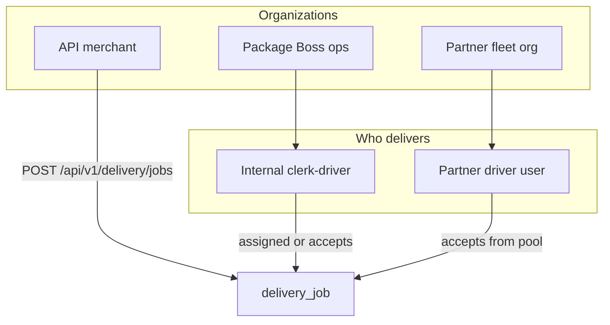

# Local Delivery Platform — Architecture & Roadmap

This document describes how Package Boss local delivery should evolve from the current **`logistics_jobs`** implementation on `delivery-branch` into a future-proof platform that supports:

1. **Internal clerk-drivers** (Package Boss staff)
2. **Third-party partner fleets** (companies with drivers who sign in and accept jobs)
3. **Public APIs** for external websites to create deliveries at checkout

It complements the existing **warehouse package delivery** flow (`delivery_requests`), which moves customer packages from the Fort Lauderdale warehouse to home addresses in Kingston/Portmore.

---

## Table of contents

- [Two products, one engine](#two-products-one-engine)
- [Current state (delivery-branch)](#current-state-delivery-branch)
- [Actor model](#actor-model)
- [Database structure](#database-structure)
- [Fulfillment flows](#fulfillment-flows)
- [Public API (checkout integration)](#public-api-checkout-integration)
- [Security & billing](#security--billing)
- [Migration from today](#migration-from-today)
- [Implementation phases](#implementation-phases)
- [What to avoid](#what-to-avoid)

---

## Two products, one engine

| Product | Table today | Purpose |
|---------|-------------|---------|
| **Package home delivery** | `delivery_requests` | Customer packages received at warehouse → delivered to saved address |
| **Local / on-demand delivery** | `logistics_jobs` | Standalone pickup → dropoff (islandwide logistics service) |

**Direction:** Evolve `logistics_jobs` into a unified **`delivery_jobs`** concept (rename optional) with a **`source`** field so all fulfillment types share status, assignment, tracking, events, and billing.

| `source` value | Created by |
|----------------|------------|
| `customer_app` | Logged-in customer (Book Logistics UI) |
| `warehouse` | Staff linking package delivery to same driver pool (future) |
| `api` | Partner / merchant via Package Boss Delivery API |
| `staff` | Admin or clerk manual entry |

---

## Current state (delivery-branch)

### `logistics_jobs` (local delivery)

Key fields today:

- Pickup / dropoff → `delivery_addresses`
- `assigned_clerk_id` — internal clerk assigned by admin
- `driver_name`, `driver_contact_number` — manual external driver (no login)
- Status pipeline: `pending` → `picked_up` → `in_transit` → `completed` (plus `cancelled`, `rejected`)
- Pricing: in-house parishes (Kingston/Portmore) vs islandwide fee constants

### Gaps for future requirements

| Need | Gap today |
|------|-----------|
| Clerk as driver | Partial — clerk assignment exists, no shared “driver pool” abstraction |
| Partner org + driver login | External driver is free text only |
| Driver self-accept | No `offered` / `accepted` assignment model |
| Checkout API | No partner identity, API keys, or webhooks |
| Audit / tracking API | Timestamps on job row; no separate event stream for integrators |

---

## Actor model



### User roles (extend over time)

| Role / identity | Description |
|-----------------|-------------|
| `clerk` + permission `local_delivery_driver` | Internal driver; subset of clerks who can run local jobs |
| `partner_admin` | Manages a third-party fleet (users, parishes, vehicles) |
| `partner_driver` | Driver under a partner org; logs in, views and accepts jobs |
| `api_client` | Machine identity (API key / OAuth client), not a human user |

**Principle:** Do not overload a single generic `driver` role. Internal staff, partner drivers, and API clients have different permissions, payouts, and SLAs.

---

## Database structure

### Core: `delivery_jobs` (evolve `logistics_jobs`)

Keep existing columns where possible. Add:

| Column | Type | Purpose |
|--------|------|---------|
| `source` | string | `customer_app`, `warehouse`, `api`, `staff` |
| `external_reference` | string, indexed | Merchant order ID from checkout |
| `partner_id` | UUID FK, nullable | API / fleet owner |
| `merchant_id` | UUID FK, nullable | Optional sub-merchant under partner |
| `fulfillment_mode` | string | `internal`, `partner_pool`, `manual`, `hybrid` |
| `final_fee_jmd` | numeric | Settled price (vs `quoted_fee_jmd`) |
| `payout_jmd` | numeric | Amount owed to driver / partner |

Pickup and dropoff continue to reference `delivery_addresses`, or use inline stop records for one-off API jobs (see below).

### `delivery_partners`

Third-party companies and API merchants.

```
id
name
type                  -- fleet | ecommerce_api
status                -- pending | active | suspended
billing_email
webhook_url
default_commission_pct
created_at, updated_at
```

### `delivery_partner_users`

Links platform users to a partner org.

```
id
partner_id            -- FK delivery_partners
user_id               -- FK users
role                  -- admin | dispatcher | driver
is_active
parishes_served       -- JSON array
vehicle_type
max_active_jobs
created_at, updated_at
```

### `delivery_assignments`

One job can have assignment history; one **active** assignee at a time.

```
id
delivery_job_id       -- FK
assignee_type         -- internal_user | partner_driver | manual
assignee_user_id      -- FK users, nullable
partner_id            -- FK, nullable
assigned_by_id        -- FK users (staff/admin/dispatcher)
assigned_at
accepted_at
started_at
completed_at
status                -- offered | accepted | declined | cancelled | completed
decline_reason
```

**Replaces over time:** `assigned_clerk_id` + free-text `driver_name` / `driver_contact_number` on the job row (migrate into assignments).

### `delivery_job_events`

Audit trail and tracking feed for apps and webhooks.

```
id
delivery_job_id
status
note
actor_type            -- user | system | api_client
actor_id
latitude, longitude   -- optional
created_at
```

### `api_clients`

Credentials for checkout / integration partners.

```
id
partner_id            -- FK delivery_partners
client_id             -- public identifier (pk_live_...)
client_secret_hash
scopes                -- JSON: jobs:create, jobs:read, webhooks
rate_limit_tier
allowed_origins       -- optional
ip_allowlist          -- optional
is_sandbox
created_at, revoked_at
```

### `delivery_job_stops` (optional, Phase 3+)

For API-created jobs without a Package Boss customer account:

```
id
delivery_job_id
stop_type             -- pickup | dropoff
line1, line2, parish, community
contact_name, contact_number
sort_order
```

---

## Fulfillment flows

### A. Internal clerk-driver

```
pending → assigned (clerk) → picked_up → in_transit → completed
```

- Assignment: `delivery_assignments.assignee_type = internal_user`
- Admin or dispatcher assigns clerk from dispatch board
- Clerk updates status via warehouse / clerk local delivery UI

### B. Partner org with registered drivers

```
pending → offered_to_partner → accepted_by_driver → picked_up → in_transit → completed
```

- Job assigned to **partner** or released to **partner pool** by parish
- Partner drivers see available jobs; first accept wins (or dispatcher assigns explicitly)
- Payout tracked on `payout_jmd` per partner rules

### C. Manual external driver (legacy / transition)

```
pending → driver_confirmed (name + phone) → picked_up → … → completed
```

- Maps to today’s `confirm_logistics_driver()` flow
- Becomes `assignee_type = manual` until driver onboards as `partner_driver`

### D. Dispatch board (staff)

Single view grouped by:

- Parish / community
- Unassigned vs internal vs partner vs in progress
- `fulfillment_mode` and `source` filters

---

## Public API (checkout integration)

**Base path (proposed):** `/api/v1/delivery`

**Auth:** API key or OAuth2 client credentials scoped to `partner_id`.  
**Required header on creates:** `Idempotency-Key` (checkout retries must not duplicate jobs).

### Endpoints

| Method | Path | Description |
|--------|------|-------------|
| `POST` | `/quotes` | Rate estimate from pickup/dropoff parish, vehicle, speed |
| `POST` | `/jobs` | Create delivery at checkout |
| `GET` | `/jobs/{id}` | Job status + tracking summary |
| `GET` | `/jobs/{id}/events` | Event timeline |
| `POST` | `/jobs/{id}/cancel` | Cancel if still cancellable |
| `POST` | `/webhooks/test` | Verify partner webhook URL |

### Example: create job

```json
POST /api/v1/delivery/jobs
Authorization: Bearer pk_live_...
Idempotency-Key: checkout-ORDER-8842

{
  "external_reference": "ORDER-8842",
  "pickup": {
    "line1": "12 Half Way Tree Road",
    "parish": "Kingston",
    "contact_name": "Store Name",
    "contact_number": "+18765551234"
  },
  "dropoff": {
    "line1": "45 Hope Road",
    "parish": "St. Andrew",
    "contact_name": "Jane Customer",
    "contact_number": "+18765555678"
  },
  "item_description": "2x shoe boxes",
  "vehicle_type": "car",
  "delivery_speed": "immediate",
  "payment_method": "prepaid",
  "callback_url": "https://merchant.example.com/webhooks/packageboss"
}
```

### Example: response

```json
{
  "id": "uuid",
  "reference": "LD-000123",
  "status": "pending",
  "quoted_fee_jmd": 800,
  "tracking_url": "https://www.packagebossja.com/track/LD-000123",
  "external_reference": "ORDER-8842"
}
```

### Webhooks (to merchant)

Events: `job.created`, `job.assigned`, `job.picked_up`, `job.in_transit`, `job.completed`, `job.cancelled`, `job.failed`

- POST to partner `webhook_url`
- Sign payload with HMAC-SHA256 using client secret
- Retries with exponential backoff

---

## Security & billing

| Area | Approach |
|------|----------|
| **Partners** | `pending` → `active` after approval; suspend without deleting history |
| **API keys** | Separate sandbox (`pk_test_`) and live keys; rotate and revoke |
| **Rate limits** | Per `api_client`; stricter on quote/create |
| **Clerk drivers** | Permission `local_delivery_driver`, not all clerks by default |
| **Parish rules** | `parishes_served` on partner users and internal drivers |
| **Payouts** | `payout_jmd` on job; partner commission rules on `delivery_partners` |
| **Idempotency** | Store idempotency keys per partner + external_reference unique index |

---

## Migration from today

| Current (`logistics_jobs`) | Future |
|----------------------------|--------|
| `customer_id` | Keep; API jobs also set `partner_id` + `external_reference` |
| `assigned_clerk_id` | → `delivery_assignments` (`internal_user`) |
| `driver_name`, `driver_contact_number` | → `partner_driver` user or `manual` assignment |
| `confirm_logistics_driver()` | → create assignment row + optional user FK |
| Status columns on job | Keep; optional `offered` / `accepted` before `picked_up` |
| `delivery_requests` (packages) | Phase 5+ optional: same assignment pool for warehouse home delivery |

**Rule:** One job table, many assignment types — do not split into `clerk_jobs`, `partner_jobs`, and `api_jobs`.

---

## Implementation phases

### Phase 1 — Assignment foundation (delivery-branch)

**Goal:** Clerk drivers work cleanly; prepare for partners without breaking current UI.

- [ ] Add `delivery_assignments` table
- [ ] Migrate `assigned_clerk_id` reads/writes to assignments (keep column synced or deprecate)
- [ ] Add `delivery_job_events` for status changes
- [ ] Add `source` column defaulting to `customer_app`
- [ ] Clerk permission `local_delivery_driver`
- [ ] Update dispatch / clerk local delivery pages to use assignment model

**Exit criteria:** Existing book → assign clerk → complete flow unchanged for users; events queryable.

---

### Phase 2 — Partner organizations & driver login

**Goal:** External fleets onboard; drivers sign in and accept jobs.

- [ ] Add `delivery_partners`, `delivery_partner_users`
- [ ] Roles: `partner_admin`, `partner_driver`
- [ ] Partner admin UI: invite drivers, set parishes / vehicle
- [ ] Driver app routes: list offered jobs, accept, update status
- [ ] Dispatch: assign job to partner or release to partner pool
- [ ] Replace free-text driver confirm with partner driver assignment where possible

**Exit criteria:** Partner driver can accept and complete a job end-to-end without staff typing name/phone.

---

### Phase 3 — Merchant Delivery API

**Goal:** External websites create deliveries at checkout.

- [ ] Add `api_clients` and partner type `ecommerce_api`
- [ ] Implement `/api/v1/delivery/quotes` and `/jobs`
- [ ] Idempotency store + `external_reference` unique per partner
- [ ] `delivery_job_stops` or embedded addresses for non-customer jobs
- [ ] Webhooks + signing + retry queue
- [ ] Sandbox environment and API docs (OpenAPI)

**Exit criteria:** Test merchant creates job from sample checkout; receives webhook on completion.

---

### Phase 4 — Operations & billing

**Goal:** Production-ready partner and API operations.

- [ ] Partner approval workflow (`pending` → `active`)
- [ ] Payout reporting: `payout_jmd` per job, partner statements
- [ ] Rate cards per partner (override default parish fees)
- [ ] Admin dashboard: jobs by source, partner SLA metrics
- [ ] API rate limiting and audit logs

**Exit criteria:** Finance can reconcile partner payouts; ops can suspend abusive API clients.

---

### Phase 5 — Unified fulfillment (optional)

**Goal:** One driver pool for warehouse package delivery and local logistics.

- [ ] Link `delivery_requests` fulfillment to `delivery_assignments`
- [ ] Shared dispatch board: package runs + local jobs
- [ ] Customer tracking UX unified where appropriate

**Exit criteria:** Staff can assign same partner driver to package home delivery or local job from one board.

---

## What to avoid

1. **Separate job tables per channel** — use one job model + `source` + assignments.
2. **API merchants as `users` rows** — use `delivery_partners` + `api_clients`.
3. **Only free-text external drivers** — migrate to partner users for accountability and payouts.
4. **Unindexed `external_reference`** — required for merchant support and idempotency.
5. **Skipping webhook signatures** — merchants must trust event authenticity.

---

## Related code (delivery-branch)

| Area | Path |
|------|------|
| Local delivery model | `backend/app/models/logistics_job.py` |
| Service layer | `backend/app/services/logistics_job_service.py` |
| Customer routes | `backend/app/routes/logistics_jobs.py` |
| Staff routes | `backend/app/routes/staff.py` (logistics endpoints) |
| Constants / fees | `backend/app/constants.py` |
| Customer UI | `frontend/src/pages/dashboard/DashboardLogisticsPage.tsx`, `BookLogisticsPage.tsx` |
| Clerk / admin UI | `frontend/src/pages/ClerkLocalDeliveryPage.tsx`, `AdminLocalDeliveryPage.tsx` |
| Package home delivery (separate) | `backend/app/models/delivery_request.py` |

---

## Branch & environment

- Feature work lives on **`delivery-branch`** until merged to `main`.
- Use branch-specific env files (see team docs): Neon on `main`, local/SQLite or separate Neon branch for delivery development.
- Do not commit `.env` files with secrets.

---

*Last updated: September 2026 — aligned with `logistics_jobs` on delivery-branch.*
